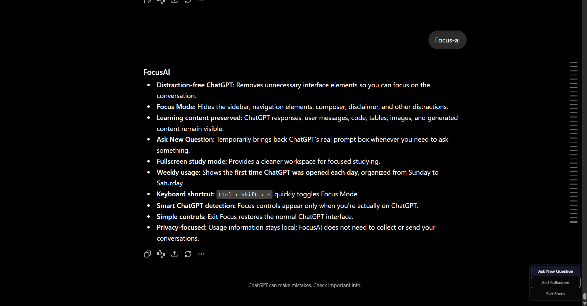
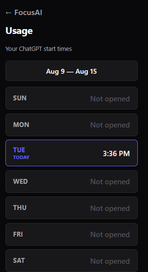
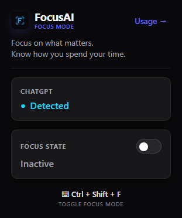

# FocusAI

### ChatGPT, without the distractions.

FocusAI is a Chrome extension designed for students who use ChatGPT for studying. It transforms ChatGPT into a cleaner, distraction-free workspace while preserving the actual learning content.



---

## Features

- **Distraction-free ChatGPT workspace** - Hide non-essential interface elements to create a focused reading and learning environment.
- **Focus Mode** - Automatically collapse sidebars, navigation headers, prompt composers, and footer disclaimers.
- **Learning content preservation** - Keep vital educational content like user questions, ChatGPT responses, code blocks, tables, and images fully visible and pristine.
- **Ask New Question** - Temporarily reveal ChatGPT's real prompt composer whenever you need to send a new message.
- **Fullscreen study workspace** - Engage in fully immersive study sessions via native browser fullscreen integration.
- **Weekly ChatGPT first-open tracking** - Simple, privacy-focused visual timeline tracking the exact timestamp of your daily first open time.
- **Smart ChatGPT detection** - Active protection and controls that automatically lock, unlock, and adapt based on whether you are on a supported ChatGPT domain.
- **Keyboard shortcut** - Toggle Focus Mode instantly using a clean system-wide shortcut (`Ctrl + Shift + F` or `Command + Shift + F`).
- **Easy restoration** - Instantly revert back to the original ChatGPT layout, preserving all normal browser and page functionality.
- **Local-first privacy** - Absolutely zero analytics, external databases, or tracking scripts. All configuration and usage history remains stored locally in your browser.

---

## Focus Mode

FocusAI hides non-essential interface elements without hiding the actual learning material. When Focus Mode is active, the extension temporarily hides distracting elements (such as the sidebar, the top header bar, the prompt composer area, and the bottom disclaimer text).

However, your actual study content is fully preserved. The following elements always remain visible and unobstructed:
- User questions and messages
- ChatGPT responses and conversations
- Inline and block code formatting
- Rendered tables and diagrams
- Injected images and math equations
- Standard ChatGPT response utilities (copy, thumbs up/down, regenerate, etc.)


*Focus Mode creates a clean study workspace while keeping the conversation and learning content visible.*

---

## Distraction-Free Study Workspace

FocusAI dynamically optimizes the reading pane layout by widening the main conversation container (up to 950px). This maximizes screen real estate and minimizes eye strain, allowing code samples, logical diagrams, and complex tables to breathe in a spacious layout designed specifically for study.

---

## Ask New Question

While Focus Mode is active, the real ChatGPT composer is hidden to maximize the reading area. Clicking the **Ask New Question** floating button reveals ChatGPT's REAL prompt composer, automatically scrolls to the bottom of the page, and places the cursor focus inside the input.

FocusAI does not create any fake input boxes or alter prompt transmission. You continue to interact with ChatGPT's real native input box and utilize all of its standard features. Once you type and send your prompt, Focus Mode remains beautifully active, instantly hiding the composer again so you can focus on the incoming response.

---

## Weekly ChatGPT Usage

FocusAI provides a simple weekly view showing when ChatGPT was first opened on each day of the week.



The usage view dynamically operates on a **Sunday → Saturday** weekly interval:
- It records and displays the exact timestamp of the **first time** you opened ChatGPT on each day of the current week.
- Displays **"Not opened"** for days where ChatGPT was not accessed.
- The week range header is calculated dynamically based on your system's current calendar (the dates "Aug 9 — Aug 15" shown in the screenshot are illustrative of the current week's range).

*Note: FocusAI is NOT a screen-time tracker, total usage tracker, or session duration tracker. It is designed purely to help you see your daily learning starting times.*

---

## Keyboard Shortcut

You can instantly toggle Focus Mode on or off using the global keyboard shortcut:

- **Windows/Linux**: `Ctrl + Shift + F`
- **macOS**: `Command + Shift + F`

This shortcut operates contextually and will not activate Focus Mode on unrelated, unsupported websites. You can customize this shortcut at any time by navigating to `chrome://extensions/shortcuts` in Google Chrome.

---

## Smart ChatGPT Detection

The FocusAI popup dynamically adapts based on whether the active tab is a supported ChatGPT page.


*FocusAI popup with ChatGPT detection, Focus Mode control, Usage access, and keyboard shortcut information.*

- **When ChatGPT is detected**:
  - The popup displays a cyan **Detected** status badge.
  - The interactive Focus State switch is enabled, allowing you to toggle Focus Mode.
  - The custom `Ctrl + Shift + F` shortcut becomes contextually active.
- **When ChatGPT is not detected**:
  - The popup displays a neutral **Not detected** badge.
  - The Focus Mode switch is locked to prevent corrupting state.
  - An **Open ChatGPT** button is displayed to launch ChatGPT in a new tab.

---

## How It Works

### Focus Mode Flow
```
Open ChatGPT
  │
  ▼
FocusAI detects ChatGPT
  │
  ▼
Enable Focus Mode (Popup or Ctrl+Shift+F)
  │
  ▼
Non-essential UI is hidden (Sidebar, Header, Composer, Disclaimer)
  │
  ▼
Learning content remains visible (Conversations, Code, Tables)
  │
  ▼
Study in distraction-free workspace
  │
  ▼
Ask a new question when needed (Reveals native composer)
  │
  ▼
Exit Focus Mode to restore native ChatGPT
```

### Usage Flow
```
Open ChatGPT
  │
  ▼
FocusAI records the first opening time for that day
  │
  ▼
Weekly Usage View displays start times for Sunday → Saturday
```

---

## Installation

FocusAI is built strictly using vanilla web technologies and Chrome extension standards, meaning no build tools, compilation steps, or complex bundlers are required to run it locally.

### Chrome Developer Installation:

1. **Clone the Repository:**
   ```bash
   git clone https://github.com/focusai-chatgpt/focusai-chatgpt.git
   cd focusai-chatgpt
   ```

2. **Open Extensions Page:**
   - In Google Chrome, navigate to `chrome://extensions/`.

3. **Enable Developer Mode:**
   - Toggle the **Developer mode** switch in the top-right corner to **On**.

4. **Load Unpacked Extension:**
   - Click the **Load unpacked** button in the top-left corner.
   - Select the `focusai-chatgpt` root directory (the folder containing `manifest.json`).

5. **Pin the Extension:**
   - Click the puzzle piece icon in your Chrome toolbar and pin **FocusAI** for easy access.

---

## Usage

1. Open ChatGPT ([https://chatgpt.com](https://chatgpt.com) or [https://chat.openai.com](https://chat.openai.com)).
2. Click the FocusAI extension icon in your browser toolbar.
3. Confirm that the status card shows **Detected**.
4. Toggle the **Focus State** switch to **Active**, or press `Ctrl + Shift + F` to enable Focus Mode.
5. Study in your pristine, distraction-free study workspace.
6. Click **Ask New Question** in the bottom-right corner when you want to type a new question.
7. Click **Exit Focus** in the bottom-right corner, or toggle the switch again, to restore ChatGPT's default UI.
8. Click **Usage →** in the top-right corner of the popup to view your weekly ChatGPT daily start times.

---

## Tech Stack

FocusAI is constructed purely using vanilla browser APIs and extension architectures without the overhead of external frameworks, heavy runtime libraries, or bundlers:

- **Chrome Extension APIs** - Tailored utilizing Manifest V3 specifications.
- **Vanilla JavaScript (ES6+)** - Powers all modular application workflows.
- **HTML5 & CSS3** - Builds the extension popups and layout modifications.
- **Chrome Storage API (`chrome.storage.local`)** - For lightweight, local-first data persistence.
- **Service Worker / Background Scripts** - Event-driven extension state orchestrator.
- **Content Scripts** - Injected directly into matching pages for safe, isolated DOM interactions.
- **DOM-based UI Discovery Engine** - Heuristic evaluation algorithm to identify ChatGPT interface elements reliably.
- **Fullscreen API** - Seamlessly integrates native full-viewport capability.

---

## Project Structure

```
focusai-chatgpt/
├── background/
│   └── service-worker.js       # Background event listener, state coordinator, and shortcut handler
├── content/
│   └── content.js              # Injectable content script handling messages and engine activation
├── core/
│   ├── focus/
│   │   └── focus-engine.js     # Dom discovery heuristics, hiding mechanism, and layout expansion
│   ├── messaging/
│   │   └── messages.js         # Standardized messaging definitions and contract handshakes
│   ├── platform/
│   │   └── chatgpt.js          # Platform utility matching rules for valid ChatGPT domains
│   ├── storage/
│   │   └── storage.js          # Promise-based wrapper interface for local chrome.storage
│   └── usage/
│       └── usage-tracker.js    # Time recorder for daily first-opens and Sunday-Saturday ranges
├── docs/
│   └── screenshots/            # Product screenshots referenced inside documentation
│       ├── chatgpt-ui.png
│       ├── chatgpt-focus-ai-popup.png
│       └── focus-ai-chatgpt-sessions.png
├── icons/
│   ├── icon16.png              # Standard extension action bar and shortcut icons
│   ├── icon32.png
│   ├── icon48.png
│   ├── icon128.png
│   └── focusai-logo.svg        # Custom geometric source SVG vector logo
├── manifest.json               # Extension configuration metadata and entrypoint declarations
├── PrivacyPolicy.md            # Comprehensive user local-first data usage agreement
├── RELEASE_CHECKLIST.md        # Checkpoints list for web store distribution requirements
└── README.md                   # Project description and manual guide
```

---

## Privacy

FocusAI is designed with a strict, local-first architectural approach:

- All operations and interface manipulations are performed **strictly locally** on your machine.
- FocusAI **never** collects, captures, or transmits your ChatGPT prompts, conversation history, files, user accounts, or profile data.
- The Weekly Usage View saves your daily first-open timestamp exclusively within `chrome.storage.local` on your local device. This data is never sent to any external server or analytics database.

---

## Screenshots

### 1. Distraction-Free Study Workspace

*A clutter-free reading pane maximizing screen space, keeping responses, images, code, and chat utilities accessible while floating study controls sit in the bottom right.*

### 2. Live Tab Detection & Toggles

*The modern extension popup displaying the active tab's 'Detected' status, a clean toggle switch, and a reminder of the global Ctrl+Shift+F keyboard shortcut.*

### 3. Weekly Learning Activity

*The elegant dashboard showing exactly when you initiated your daily studies on ChatGPT throughout the current week.*

---

## Future Improvements

- **Additional Focus Mode customization** - Options to customize which native elements to hide or show selectively.
- **More study-oriented controls** - Integrated timers, quick links to study bookmarks, or custom reading themes.
- **UI Evolution Compatibility** - Continuously updating DOM heuristics to adapt to future ChatGPT redesigns.

---

## License

This project is licensed under the MIT License - see the LICENSE file for details.
